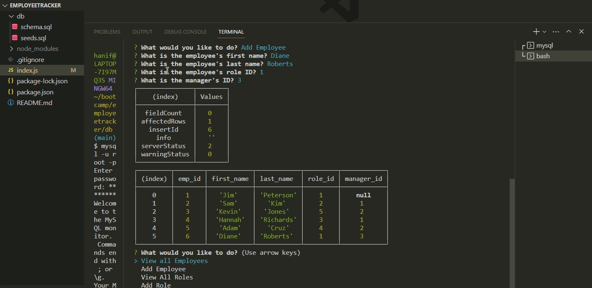

# EmployeeTracker

## Description

We built a command-line application from scratch to manage a company's employee database, using Node.js, Inquirer, and MySQL. This employee tracker enables us to view and manage departments, roles, and employees in a company to organize and plan business.

## Screenshot

## Video Walkthrough

[employeetracker.webm](https://user-images.githubusercontent.com/116910257/226126127-3bf16ad8-61ad-4983-a6f5-20b39a9b598f.webm)

## Link

<a href=https://github.com/shobannah/EmployeeTracker.git> Employee Tracker - Github Repo
